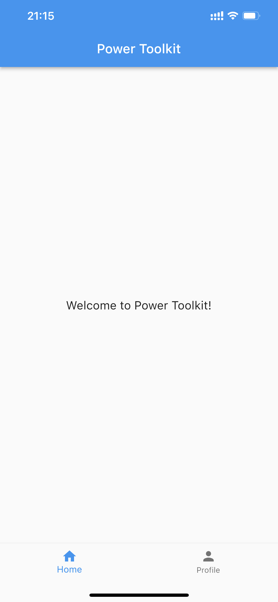
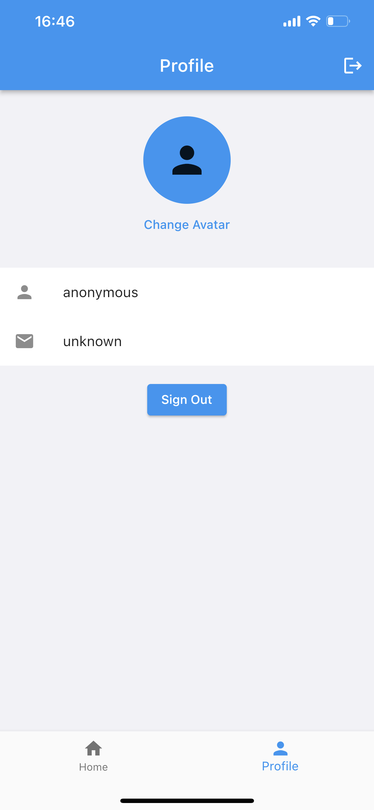

<!--
SPDX-FileCopyrightText: 2022 Jinsong, Zhu <jasonzjs@amazon.com>

SPDX-License-Identifier: MIT-0
-->

## AWS-Amplify-Flutter-Example

This is a mobile application based on Flutter and Amplify, including text recognition (OCR) capabilities provided by [AWS AI-Solution Kit](https://www.amazonaws.cn/en/solutions/ai-solution-kit/).

## Table of Contents

- [Environment requirements](#environment-requirements)
- [Features](#features)
- [Prototype](#prototype)
- [Architecture](#architecture)
- [Development](#development)

## Environment requirements

* [Flutter](https://github.com/flutter/flutter) >=3.3.0
* Dart 2.18.0
* Amplify CLI >=11.0
* AWS Account
* AWS CLI (optional)
* git 2.34.1
* Android Studio or [Visual Studio Code ](https://docs.flutter.dev/development/tools/vs-code)
* Xcode for iOS Development (optional)
* Text Recognition (OCR) Solution provided by [AWS AI-Solution Kit](https://www.amazonaws.cn/en/solutions/ai-solution-kit/)

## Features

| Category       | Aws Provider       | Description                    |
| -------------- | ------------------ | ------------------------------ |
| Authentication | Amazon Cognito     | Login, and sign up by email.   |
| Analytics      | Amazon Pinpoint    | Collect Analytics data.        |
| REST API       | Amazon API Gateway | Manually trigger recognition.  |
| GraphQL API    | AWS AppSync        | CRUD operations with DynamoDB. |
| Storage        | Amazon S3          | Store uploaded images.         |
| OCR            | AWS AI Solution Kit| Text recognition (OCR).        |

## Prototype
### Basic




### Integrate With OCR Solution


## Architecture


## Development

### How to use
If you want to use the OCR Solution on the application, you need to deploy the Text Recognition (OCR) Solution provided by [AWS AI-Solution Kit](https://www.amazonaws.cn/en/solutions/ai-solution-kit/). you can follow [the deployment guide](https://awslabs.github.io/aws-ai-solution-kit/en/deploy-general-ocr/) here.

Then you need to initialize the amplify configuration by executing the command ```amplify push```, this will generate amplifyconfiguration.dart under lib folder.

Now, you can install the flutter dependencies by using ```flutter pub get```, and run the application on simulator or devices.

### Workshop for basic features

In this workshop, you will build an application with the following features:
* Authentication, including login, sign up, confirmation.
* User Profile, including uploading and changing avatars.
* Collect Analytics Data, including loginEvent, signUpEvent, etc.

For more information, you can see [architecture](./doc/3.1Architecture.md) and [implementing](./doc/3.2Implementing.md).

### Workshop on Integration with OCR Solution

In this workshop, you will build an application that integrated with OCR Solution.  
For more information, you can see [architecture](./doc/4.1Architecture.md) and [implementing](./doc/4.2Implementing.md).

## Security

See [CONTRIBUTING](CONTRIBUTING.md#security-issue-notifications) for more information.

## License

This library is licensed under the MIT-0 License. See the LICENSE file.

