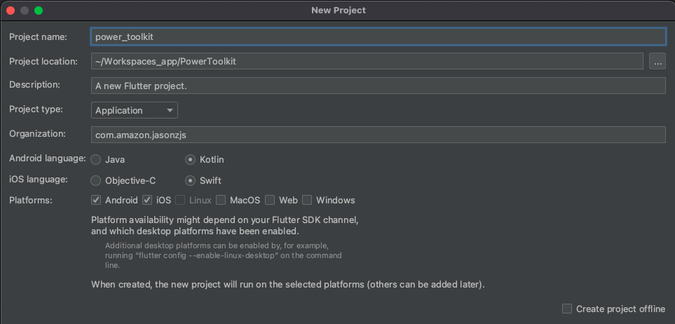
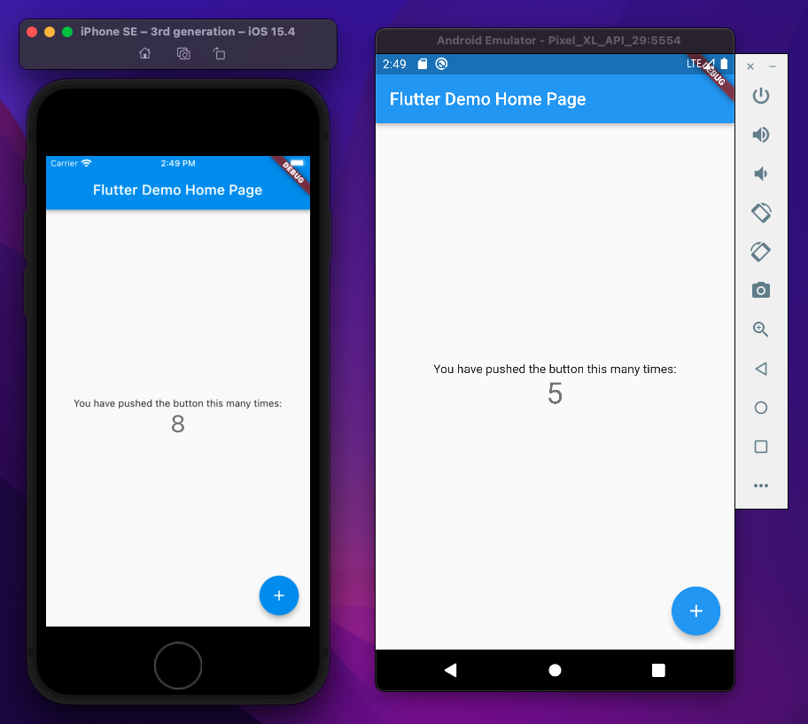

<!--
SPDX-FileCopyrightText: 2022 Jinsong, Zhu <jasonzjs@amazon.com>

SPDX-License-Identifier: MIT-0
-->

# Create Project

## New Project by Android Studio

1. Open Android Studio, then click File -> New -> New Flutter Project...
2. Select Fultter SDK path and click next button.
3. Enter project name and organization, select Android and iOS as platforms then click Finish button.

## Test Project

1. Open iOS Simulator and Android Emulator.
2. Run main.dart

