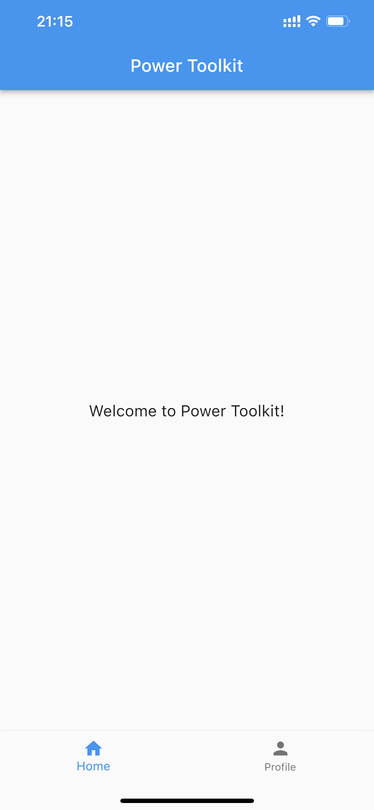
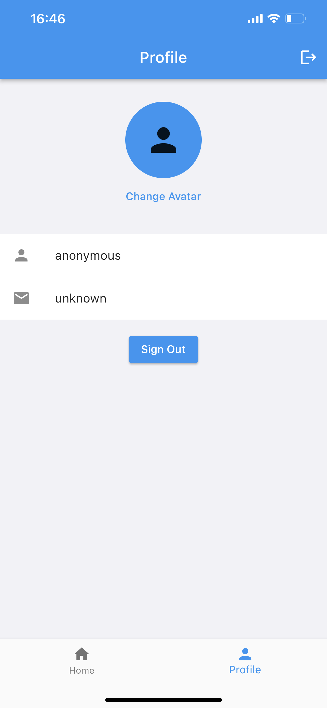
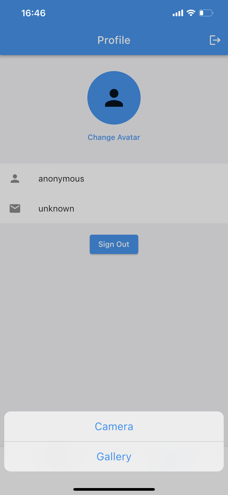
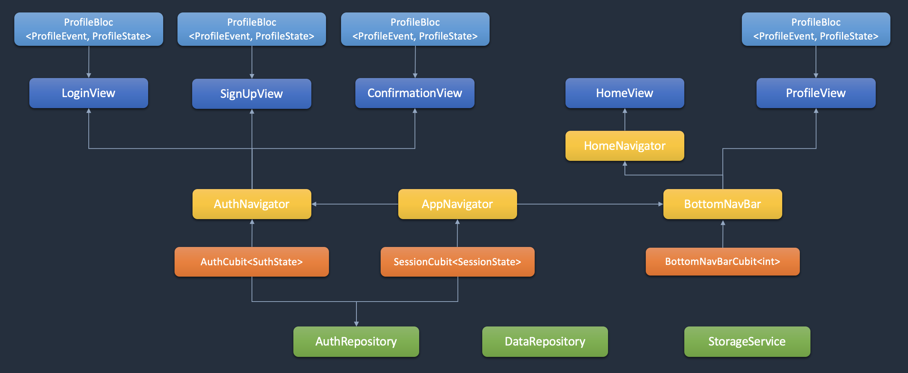
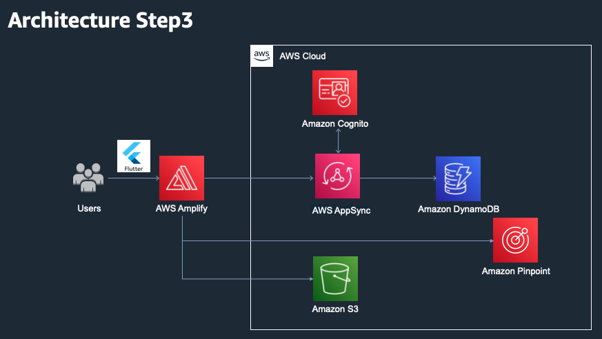

<!--
SPDX-FileCopyrightText: 2022 Jinsong, Zhu <jasonzjs@amazon.com>

SPDX-License-Identifier: MIT-0
-->

# Architecture

## Views List

* Login View
* Sign Up View
* Confirmation Code View
* Home view
* Profile View

## Diagram

Notice: This project uses [flutter_bloc](https://github.com/felangel/bloc/tree/master/packages/flutter_bloc) for state management.

### Bloc Architecture

### App Architecture

### Full Architecture

